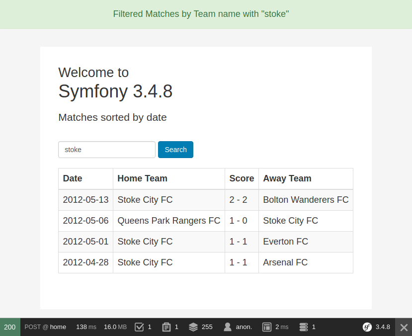

# JSON based API example - Symfony 3.4 App

## Install
Run `cp app/config/parameters.yml.dist app/config/parameters.yml`
Set your parameters in app/config/parameters.yml
Run `composer install` in your root directory.

## DB Config, Fetch Data, Insert into DB
1. Run `php bin/console doctrine:database:create` to create new database.
2. Run `php bin/console doctrine:migrations:migrate` to run migration process and build database schema according to our doctrine entities.
3. Run `php bin/console fetch:soccerway:data` to fetch demo data from external resource and insert into your DB.

## Dev Server
1. Run `php bin/console server:start` for start a dev server. Navigate to `http://localhost:8000`.
2. Run `php bin/console server:stop` for stop a dev server.

## Run Tests
1. Run `./vendor/bin/simple-phpunit` from project root to run all phpunit tests.
2. Run `./vendor/bin/behat` from project root to run all behat suite tests.

## Description Programming Challenge
### Goals
Create an application which:
* provides a command that fetches data from `Soccerway Premier
League` and saves result into DB
 * `http://soccerway.com/national/england/premier-
league/2011-2012/regular-season/matches`
* provides a REST API which uses this data to return some JSON 

* provides a simple HTML page to search and filter matches in the table by name

### Requirements
* Tested via PHPUnit, Behat
* Use Symfony 3.4
* Use Guzzle for fetching data

* The request `dates` parameters you get from the user validated before usage

### Hints 
* Consider using DB relationships: ManyToOne, OneToMany
* Code architecture
* Coding standards
* Code tidiness
* Type hinting
* Tests quality

### API description
* `http://localhost:8000/api/standings`
* Parameters:
    * `from` (optional) only return matches after this date
, the date should match the `Y-m-d` format otherwise return an error;
    * `to` (optional) only return matches before this date, the date should match the `Y-m-d` format otherwise return an error;
* Usage example:
    * `/api/standings`
    * `/api/standings?from=2012-01-01&to=2012-02-01`
* Expected output:
```
[
    {
        "place" : 1,
        "team" : "Manchester United",
        "played" : 10,
        "wins" : 9,
        "draws" : 1,
        "losses" : 0,
        "points" : 28
    },
    {
        "place" : 2,
        "team" : "Manchester City",
        "played" : 10,
        "wins" : 8,
        "draws" : 1,
        "losses" : 1,
        "points" : 25
    },
]
```

### Website description
* `http://localhost:8000/` - (homepage)
* The results should be sorted by the `date`.
* A HTML input text allows filtering this list so that the list will only
include matches where the football `home team` or the `away team` contains
the text in the input box.
* Expected output is an HTML page with a list of all football matches with:
    * the home team
    * the away team

    * the date of the match
    * the score of the match

### Screenshots




